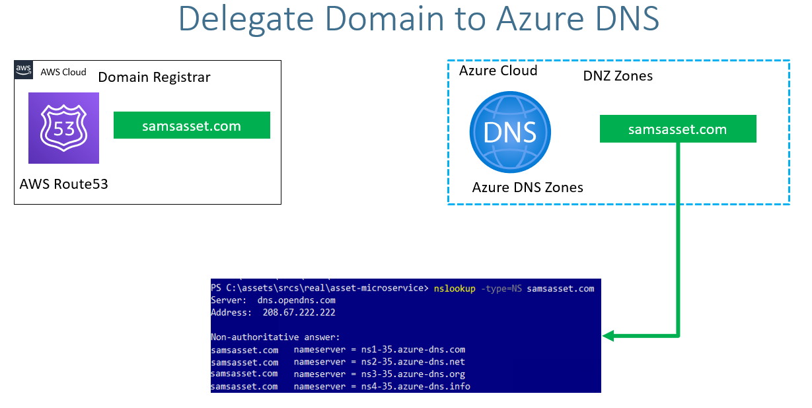

# Delegate Domain to Azure DNS

## Step-01: Get Starting
- Basic Concept
  - Domain Registrar
  - DNS Zones
  - Private DNS Zones
  - Delegate a domain from AWS Route53 to Azure DNS by creating DNS Zones in Azure Cloud
   
- Position of DNS Zone Component - Public DNS Zone and Private DNS Zone
  

## Step-02: DNS Zones - Create DNS Zone
- Go to Service -> **DNS Zones**
- **Subscription:** Azure subscription 1
- **Resource Group:** dns-zone
- **Name:** samsassets.com
- **Resource Group Location:** Australia East
- Click on **Review + Create**

## Step-03: Make a note of Azure Nameservers
- Go to Services -> **DNS Zones** -> **samsassets.com**
- Make a note of Nameservers
```
ns1-35.azure-dns.com.
ns2-35.azure-dns.net.
ns3-35.azure-dns.org.
ns4-35.azure-dns.info.
```

## Step-04: Update Nameservers at your Domain provider (Mine is AWS)
- **Verify before updation**
```
nslookup -type=SOA samsassets.com
nslookup -type=NS samsassets.com
```
- Go to AWS Route53 (This is my Domain Provider)
- Go to Services -> Route53 -> Registered Domains -> samsassets.com
- Click on **Add or edit name servers**
- Update Azure Name servers here and click on **Update**
- Click on **Hosted Zones**
- Delete the hosted zone with name **samsassets.com**
- **Verify after updation**
```
nslookup -type=SOA samsassets.com 8.8.8.8
nslookup -type=NS samsassets.com 8.8.8.8
```


## Add something for the Private DNS Zone
- private zone
- add Virtual network Link for the private zone so that the machines in specific virtual network can access the domain name
